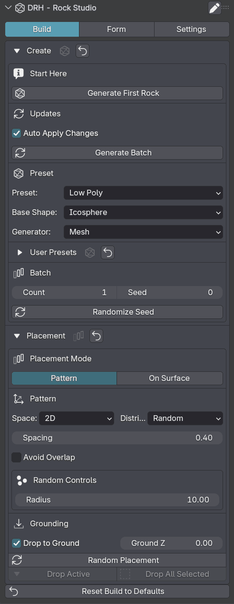
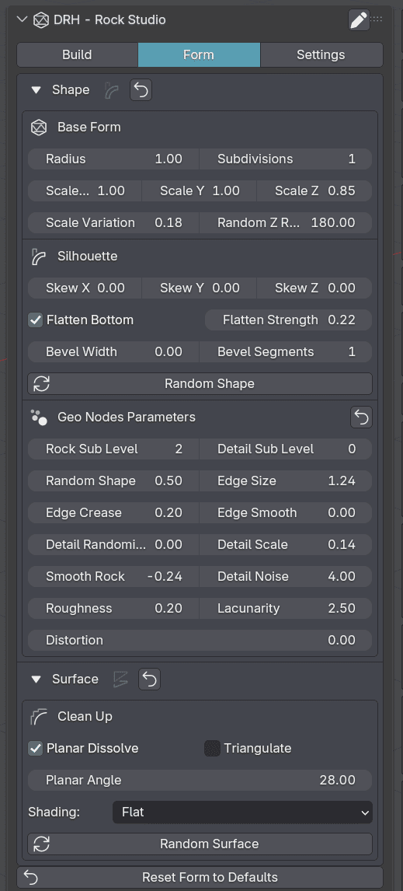
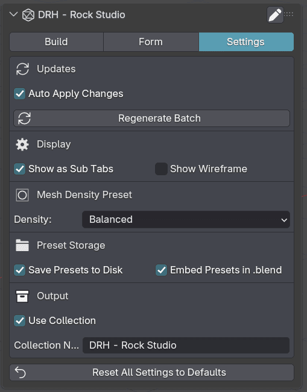
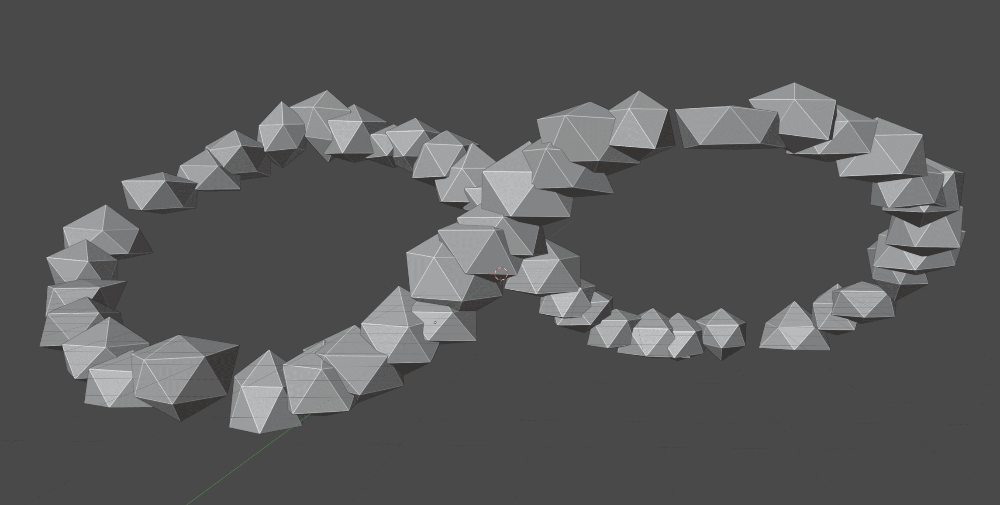

  

 

# DRH - Rock Studio

### Public Support Hub · Documentation · Feedback · Pre-release Validation

**A Blender utility for generating procedural rock assets as Mesh objects or Geometry Nodes setups, with predefined 2D and 3D placement arrangements.**

 

**Part of the DRH Add-ons ecosystem — Blender tools, updates, and releases.**

<!--

-->

---

**DRH - Rock Studio** helps Blender users generate procedural rock assets as Mesh objects or Geometry Nodes setups, then arrange them using predefined 2D and 3D placement patterns.

This repository is the central public hub for support, documentation, issue tracking, compatibility feedback, and community validation before marketplace release.

---

  
<strong>📚 Table of Contents</strong>

## Menu

- [Overview](#overview)
- [Media preview](#media-preview)
- [What DRH - Rock Studio does](#what-drh---rock-studio-does)
- [Key features](#key-features)
- [Full feature list](#full-feature-list)
- [Who is it for?](#who-is-it-for)
- [Current status](#current-status)
- [Feedback wanted before release](#feedback-wanted-before-release)
- [Quick links](#quick-links)
- [Before you post](#before-you-post)
- [Where to post](#where-to-post)
- [Support policy](#support-policy)
- [Technical notes](#technical-notes)
- [Availability](#availability)
- [Documentation](#documentation)
- [License](#license)

---

## Overview

**DRH - Rock Studio** is a Blender workflow utility designed to help users create procedural rock assets, choose between Mesh or Geometry Nodes output, explore shape variations, and arrange rocks using predefined 2D and 3D placement layouts.

It is intended for environment artists, asset creators, game artists, procedural artists, scene builders, and Blender users who need rock forms for natural scenes, terrains, props, kitbashing, scattering layouts, or visual development.

Instead of modeling every rock manually from scratch or arranging assets one by one, DRH - Rock Studio helps turn rock creation and placement into a faster, more adjustable, and repeatable workflow.

## Media preview

<!--

  

-->

<!--

---

### Demo video

Replace `YOUTUBE_VIDEO_ID` with your real YouTube video ID.

Example:
https://www.youtube.com/watch?v=YOUTUBE_VIDEO_ID

  
   
  Click the image to watch the demo on YouTube.

-->

<!--
### Quick demo GIF

Recommended size: 1280x720 or 960x540.

  

-->

### Early Screenshots

| Rock Generation and Placement | Shape and Surface Controls |
|---|---|
|  |  |

  
<strong>More Screenshots...</strong>

| Rock Studio Settings | Generated Rock Pattern Preview |
|---|---|
|  |  |

<!--
### Visual preview

Use this section if you want one large image instead of a gallery.

  

-->

<!--
Temporary placeholder while media is not available.

Media preview coming soon.

-->

---

## What DRH - Rock Studio does

DRH - Rock Studio helps you create, configure, and arrange rock assets directly inside Blender.

It is not only a simple object preset tool. It is designed as a workflow helper for generating rock forms, choosing between Mesh or Geometry Nodes output, creating variations, and placing rock arrangements using predefined 2D and 3D layouts.

Use it to:

- Generate rock assets faster
- Create rocks as Mesh objects
- Create rocks as Geometry Nodes setups
- Build natural-looking shape variations
- Use predefined 2D placement arrangements
- Use predefined 3D placement arrangements
- Explore procedural rock forms
- Build environment props and terrain details
- Reduce repetitive manual modeling and placement work
- Create reusable rock variations for scenes
- Support asset creation for games, renders, kitbashing, or BlenderKit-style workflows

---

### Key Features

- Generate procedural rocks as Mesh or Geometry Nodes assets
- Massive placement system with 2D, 3D, and on-surface scatter workflows
- Ready-made rock presets for rapid environment production
- Procedural variation controls for more natural and less repetitive sets
- Surface scatter and drop tools for faster scene dressing
- Auto Apply and manual Apply Changes workflow for heavy rebuild safety
- User preset storage on disk and inside the blend file
- LOD and preview density controls to balance speed and detail

---

  
<strong>🧩 Full feature list</strong>

## Full feature list

### Generation Modes

- Mesh generation mode
- Geometry Nodes generation mode
- Preview density: Full
- Preview density: Draft
- Preview density: Ultra Draft
- First-rock generation workflow
- Batch regeneration workflow

### Rock Presets & Profiles

- Preset: Asteroid
- Preset: Basalt Rock
- Preset: Boulder
- Preset: Chalk
- Preset: Cliff
- Preset: Cliff Formation
- Preset: Craggy
- Preset: Deformed Conglomerate
- Preset: Ground Scatter
- Preset: Hero Rock
- Preset: Ice
- Preset: Low Poly
- Preset: Marble
- Preset: Monolith
- Preset: Obsidian
- Preset: Pebble
- Preset: Pumice
- Preset: Quarry Set
- Preset: Reef Cluster
- Preset: Reef Outcrop
- Preset: River Rock
- Preset: Sandstone
- Preset: Sea Stack
- Preset: Shard
- Preset: Shelly Limestone
- Preset: Slate
- Preset: Smooth Boulder
- Variation profile: Hero
- Variation profile: Debris
- Variation profile: Cliff
- Variation profile: Shard
- Variation profile: Pebble
- Randomize shape
- Randomize placement
- Randomize surface
- Seed history and randomization workflow

### Base Shapes & Surface Style

- Base shape: Cone
- Base shape: Cube
- Base shape: Cylinder
- Base shape: Icosphere
- Base shape: Octahedron
- Base shape: Quad Sphere
- Base shape: Tetrahedron
- Base shape: UV Sphere
- Material style: Basalt
- Material style: Strata
- Material style: Moss
- Material style: Ice
- Material style: Volcanic
- LOD: Low
- LOD: Balanced
- LOD: High
- LOD: Ultra

### Placement & Scatter

- Scatter mode: Pattern
- Scatter mode: On Surface
- 2D pattern: Random
- 2D pattern: Arc
- 2D pattern: Circle
- 2D pattern: Cluster
- 2D pattern: Diamond
- 2D pattern: Ellipse
- 2D pattern: Fractal
- 2D pattern: Grid
- 2D pattern: Hexagonal
- 2D pattern: Honeycomb Trim
- 2D pattern: Lemniscate
- 2D pattern: Linear
- 2D pattern: Multi Ring
- 2D pattern: Poisson Disk
- 2D pattern: Progressive Rotation
- 2D pattern: Progressive Scale
- 2D pattern: Radial
- 2D pattern: Random Grid
- 2D pattern: Rosette
- 2D pattern: Spiral
- 2D pattern: Star
- 2D pattern: Triangular
- 2D pattern: Wave
- 2D pattern: Zigzag
- 3D pattern: Cluster 3D
- 3D pattern: Cone 3D
- 3D pattern: Cylinder 3D
- 3D pattern: Dome 3D
- 3D pattern: Ellipsoid 3D
- 3D pattern: Explosion 3D
- 3D pattern: Grid 3D
- 3D pattern: Helix
- 3D pattern: Layered Sphere 3D
- 3D pattern: Lissajous 3D
- 3D pattern: Prism 3D
- 3D pattern: Pyramid 3D
- 3D pattern: Shell 3D
- 3D pattern: Spheric 3D
- 3D pattern: Stacked Rings 3D
- 3D pattern: Torus 3D
- 3D pattern: Vortex 3D
- Use active surface target
- Drop active object to ground
- Drop selected objects to ground

### Workflow Controls

- Apply Changes
- Auto Apply Changes toggle
- Regenerate Batch
- Reset active defaults
- Reset scene defaults
- Reset Geometry Nodes parameters

### Presets & Storage

- Save user presets
- Load user presets
- Delete user presets
- Open preset directory
- Export preset pack
- Store presets on disk
- Store presets inside the blend file

### UI & Integration

- Build tab
- Form tab
- Settings tab
- Optional Add > Mesh menu entry
- Sidebar category rename
- Preferences integration

---

## Who is it for?

DRH - Rock Studio is designed for:

- Environment artists
- Blender asset creators
- Game artists
- Procedural artists
- Geometry Nodes users
- Scene builders
- Kitbash creators
- BlenderKit creators
- Natural environment artists
- Stylized rendering artists
- Technical artists
- Users who need reusable rock assets, variations, placement presets, or environment props

---

## Current status

| Item | Details |
|---|---|
| **Status** | 🟣 In Development |
| **Current version** | 1.0.0 |
| **Minimum Blender version** | 4.2.0 |
| **Platforms** | Windows, macOS, Linux |
| **Release type** | In development before public marketplace release |
| **Support repository** | [DRH Rock Studio Support](https://github.com/pacosalasv/DRH_Rock_Studio-Support) |

This add-on is currently in development. Compatibility feedback, usability comments, feature expectations, and workflow suggestions are welcome before public release.

---

## Feedback wanted before release

This repository is open for public feedback before marketplace release.

Feedback is especially welcome on:

- Feature usefulness
- Mesh output expectations
- Geometry Nodes output expectations
- Rock generation expectations
- Shape control needs
- 2D placement arrangement ideas
- 3D placement arrangement ideas
- Environment asset requirements
- Game-ready or render-ready expectations
- Compatibility concerns
- Installation experience
- Documentation clarity
- Expected pricing
- Marketplace expectations

Useful feedback examples:

> “I would use this to generate rock variations for environments.”

> “I need both Mesh and Geometry Nodes output depending on the project.”

> “This should include controls for sharper or smoother rock forms.”

> “The 2D arrangements should work well for terrain dressing.”

> “The 3D arrangements should help create stacked rock clusters.”

> “This would be useful if it can quickly create rock sets, not just one object.”

---

## Quick links

- [Support repository](https://github.com/pacosalasv/DRH_Rock_Studio-Support)
- [Ask a question in Discussions](https://github.com/pacosalasv/DRH_Rock_Studio-Support/discussions)
- [Open a new issue](https://github.com/pacosalasv/DRH_Rock_Studio-Support/issues/new/choose)
- [Report a bug](https://github.com/pacosalasv/DRH_Rock_Studio-Support/issues/new?template=bug_report.yml)
- [Request a feature](https://github.com/pacosalasv/DRH_Rock_Studio-Support/issues/new?template=feature_request.yml)
- [Report a compatibility issue](https://github.com/pacosalasv/DRH_Rock_Studio-Support/issues/new?template=compatibility_issue.yml)

---

## Before you post

Please include as much of the following information as possible:

- Add-on version
- Blender version
- Operating system
- Installation method
- Clear steps to reproduce
- Expected result
- Actual result
- Error message, screenshot, or console output when available

For compatibility issues, please also include:

- Blender build type, if known
- Portable or installed Blender version
- Whether the issue happens with a clean Blender configuration
- Scene complexity, if relevant
- Whether the issue involves geometry generation, Geometry Nodes, mesh output, placement arrangements, modifiers, materials, or asset export

---

## Use Discussions for

- Questions
- How-to topics
- Installation help
- Compatibility checks
- FAQ
- Suggestions
- Pre-release feedback
- Pricing feedback
- Workflow ideas

---

## Use Issues for

- Confirmed bugs
- Reproducible compatibility problems
- Feature requests
- Regressions
- Marketplace or listing-related problems
- Documentation errors

---

## Where to post

Open a **Discussion** for:

- General questions
- Setup help
- Workflow advice
- Suggestions
- Early feedback

Open an **Issue** for:

- Confirmed bugs
- Reproducible compatibility problems
- Regressions
- Feature requests
- Documentation problems

---

## Support policy

This repository is a public support hub.

Do not post:

- Private account details
- License keys
- Payment information
- Confidential production files
- Private client files
- Sensitive system information

If a private file is required to reproduce an issue, please describe the problem first and wait for further instructions.

---

## Technical notes

This add-on is source based, with:

- No obfuscation
- No binary-only content
- No external services
- No account requirements

Local system access may be used only for normal Blender workflows such as saving files, loading assets, exporting data, or using project resources when applicable.

The add-on is intended to work locally inside Blender.

---

## Availability

This add-on may be available through multiple marketplaces and storefronts after release.

This GitHub repository remains the central public location for:

- Support
- Documentation
- Issue tracking
- Compatibility reports
- Public feedback
- Release notes

---

## Documentation

- [User Manual](docs/manual/user-manual.pdf)
- [Changelog](CHANGELOG.md)

---

## License

This repository is distributed under **GPL-3.0-or-later**.

---

### DRH Add-ons

**Blender tools, updates, and releases.**

Built for clean workflows, practical utilities, and production-friendly Blender setups.

