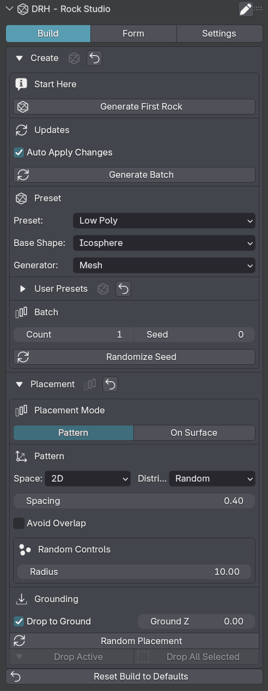
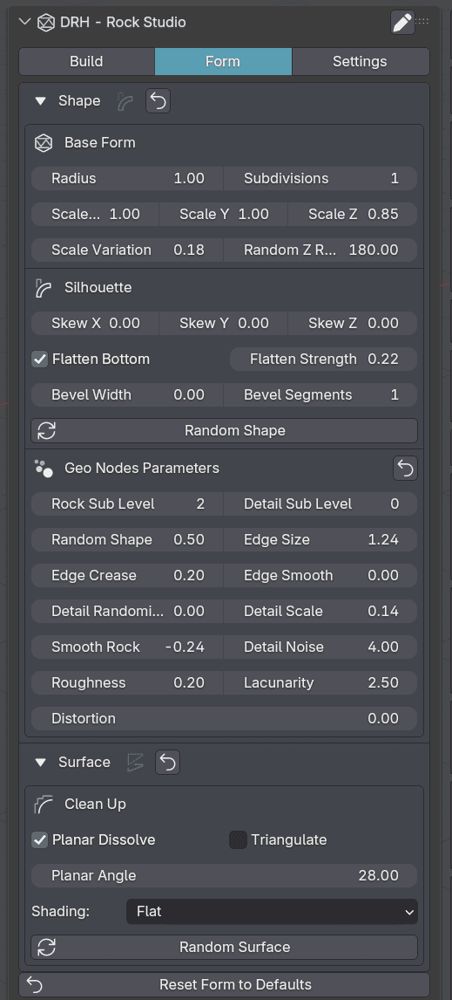
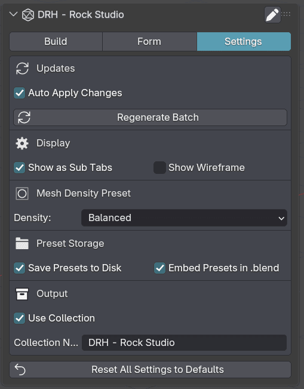
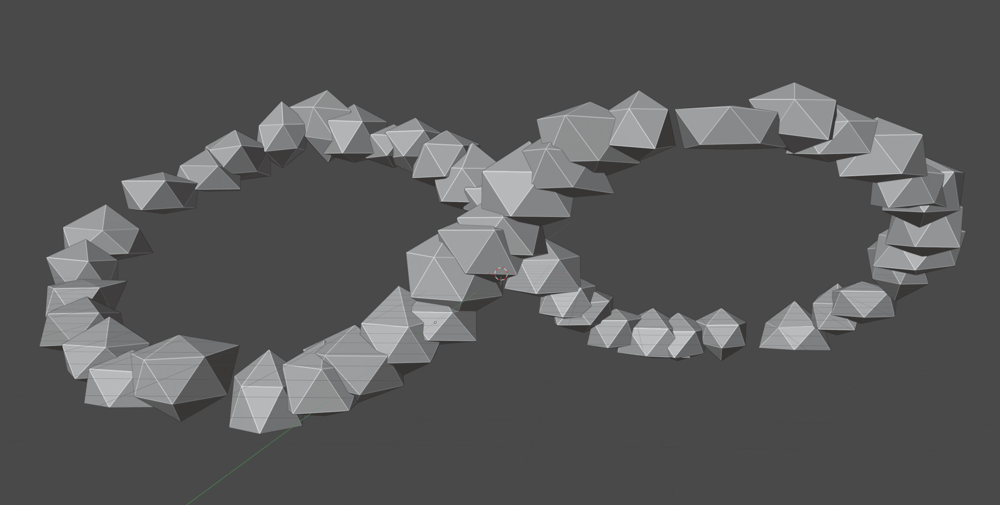

# DRH - Rock Studio

**Procedural rock generation with Mesh and Geometry Nodes workflows, advanced distributions, and surface scatter tools**

 

---

## Overview

DRH - Rock Studio is a Blender workflow utility designed to help users create procedural rock assets, choose between Mesh or Geometry Nodes output, explore shape variations, and arrange rocks using predefined 2D and 3D placement layouts.

It is intended for environment artists, asset creators, game artists, procedural artists, scene builders, and Blender users who need rock forms for natural scenes, terrains, props, kitbashing, scattering layouts, or visual development.

## Product status

| Item | Details |
|---|---|
| Status | **Development On Hold** |
| Version | 1.0.0 |
| Blender | 4.2+ |
| Platforms | Windows, macOS, Linux |
| Availability | Development is currently on hold; no public download is promoted from this repository. |
| Distribution | Support, documentation, and development history. |
| Repository role | Documentation, support, issue tracking, compatibility feedback, and product feedback |

The repository remains available for documentation and feedback while active development is paused.

## Capabilities

| Capability |
|---|
| Procedural rock generation with Mesh and Geometry Nodes workflows, advanced distributions, and surface scatter tools |

## Media

| Preview | Preview |
|---|---|
|  |  |
|  |  |

## Product reference

Open detailed feature reference

## Feature reference

### Generation modes
| Details |
|---|
| Mesh generation mode |
| Geometry Nodes generation mode |
| Preview density: Full |
| Preview density: Draft |
| Preview density: Ultra Draft |
| First-rock generation workflow |
| Batch regeneration workflow |

### Rock presets and profiles
| Details |
|---|
| Preset: Asteroid |
| Preset: Basalt Rock |
| Preset: Boulder |
| Preset: Chalk |
| Preset: Cliff |
| Preset: Cliff Formation |
| Preset: Craggy |
| Preset: Deformed Conglomerate |
| Preset: Ground Scatter |
| Preset: Hero Rock |
| Preset: Ice |
| Preset: Low Poly |
| Preset: Marble |
| Preset: Monolith |
| Preset: Obsidian |
| Preset: Pebble |
| Preset: Pumice |
| Preset: Quarry Set |
| Preset: Reef Cluster |
| Preset: Reef Outcrop |
| Preset: River Rock |
| Preset: Sandstone |
| Preset: Sea Stack |
| Preset: Shard |
| Preset: Shelly Limestone |
| Preset: Slate |
| Preset: Smooth Boulder |
| Variation profile: Hero |
| Variation profile: Debris |
| Variation profile: Cliff |
| Variation profile: Shard |
| Variation profile: Pebble |
| Randomize shape |
| Randomize placement |
| Randomize surface |
| Seed history and randomization workflow |

### Base shapes and surface style
| Details |
|---|
| Base shape: Cone |
| Base shape: Cube |
| Base shape: Cylinder |
| Base shape: Icosphere |
| Base shape: Octahedron |
| Base shape: Quad Sphere |
| Base shape: Tetrahedron |
| Base shape: UV Sphere |
| Material style: Basalt |
| Material style: Strata |
| Material style: Moss |
| Material style: Ice |
| Material style: Volcanic |
| LOD: Low |
| LOD: Balanced |
| LOD: High |
| LOD: Ultra |

### Placement and scatter
| Details |
|---|
| Scatter mode: Pattern |
| Scatter mode: On Surface |
| 2D pattern: Random |
| 2D pattern: Arc |
| 2D pattern: Circle |
| 2D pattern: Cluster |
| 2D pattern: Diamond |
| 2D pattern: Ellipse |
| 2D pattern: Fractal |
| 2D pattern: Grid |
| 2D pattern: Hexagonal |
| 2D pattern: Honeycomb Trim |
| 2D pattern: Lemniscate |
| 2D pattern: Linear |
| 2D pattern: Multi Ring |
| 2D pattern: Poisson Disk |
| 2D pattern: Progressive Rotation |
| 2D pattern: Progressive Scale |
| 2D pattern: Radial |
| 2D pattern: Random Grid |
| 2D pattern: Rosette |
| 2D pattern: Spiral |
| 2D pattern: Star |
| 2D pattern: Triangular |
| 2D pattern: Wave |
| 2D pattern: Zigzag |
| 3D pattern: Cluster 3D |
| 3D pattern: Cone 3D |
| 3D pattern: Cylinder 3D |
| 3D pattern: Dome 3D |
| 3D pattern: Ellipsoid 3D |
| 3D pattern: Explosion 3D |
| 3D pattern: Grid 3D |
| 3D pattern: Helix |
| 3D pattern: Layered Sphere 3D |
| 3D pattern: Lissajous 3D |
| 3D pattern: Prism 3D |
| 3D pattern: Pyramid 3D |
| 3D pattern: Shell 3D |
| 3D pattern: Spheric 3D |
| 3D pattern: Stacked Rings 3D |
| 3D pattern: Torus 3D |
| 3D pattern: Vortex 3D |
| Use active surface target |
| Drop active object to ground |
| Drop selected objects to ground |

### Workflow controls
| Details |
|---|
| Apply Changes |
| Auto Apply Changes toggle |
| Regenerate Batch |
| Reset active defaults |
| Reset scene defaults |
| Reset Geometry Nodes parameters |

### Presets and storage
| Details |
|---|
| Save user presets |
| Load user presets |
| Delete user presets |
| Open preset directory |
| Export preset pack |
| Store presets on disk |
| Store presets inside the blend file |

### UI and integration
| Details |
|---|
| Build tab |
| Form tab |
| Settings tab |
| Optional Add > Mesh menu entry |
| Sidebar category rename |
| Preferences integration |

## Documentation and support

| Resource | Link |
|---|---|
| User manual | [User manual](docs/manual/user-manual.pdf) |
| Support guide | [Support guide](SUPPORT.md) |
| Manual changelog | [Manual changelog](docs/manual/manual-changelog.md) |
| Product changelog | [Product changelog](CHANGELOG.md) |
| GitHub Discussions | [GitHub Discussions](https://github.com/pacosalasv/DRH_Rock_Studio-Support/discussions) |
| GitHub Issues | [GitHub Issues](https://github.com/pacosalasv/DRH_Rock_Studio-Support/issues/new/choose) |

Use **Discussions** for questions, setup help, workflow guidance, and general feedback. Use **Issues** for reproducible bugs, regressions, compatibility problems, documentation errors, and focused feature requests.

Before posting, review [SUPPORT.md](SUPPORT.md) for the shared DRH support format and public-information guidance.

## Support DRH development

If this project or another free DRH tool saves you time, optional Ko-fi support helps fund maintenance, Blender compatibility work, documentation, testing, and continued development.

  

## DRH ecosystem

| Destination | Link |
|---|---|
| DRH Add-ons Hub | [Catalog, roadmap, and product status](https://github.com/pacosalasv/DRH_Addons_Hub) |
| Paco Salas \| DRH | [GitHub profile](https://github.com/pacosalasv) |
| Support development | [Ko-fi](https://ko-fi.com/pacosalasv) |

## License

See [LICENSE](LICENSE) for repository licensing terms.
